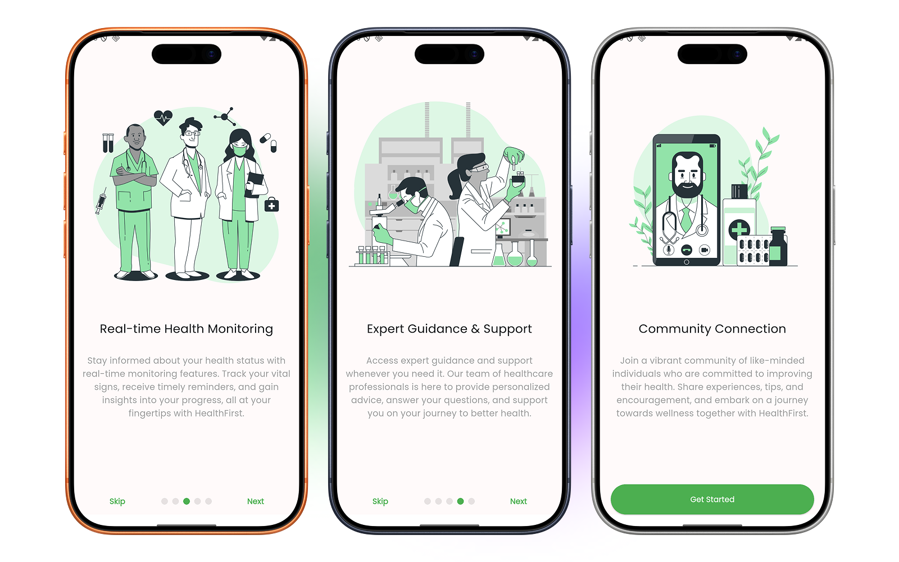

# HealthFirst - Onboarding UI


> A professional, cross-platform onboarding UI application built with Flutter. HealthFirst provides a comprehensive healthcare app experience with a beautiful, responsive onboarding journey that introduces users to personalized health management features.




## 📋 Table of Contents

- [Overview](#overview)
- [Features](#features)
- [Tech Stack](#tech-stack)
- [Installation](#installation)
- [Usage](#usage)
- [Project Structure](#project-structure)
- [Contributing](#contributing)
- [Testing](#testing)
- [Roadmap](#roadmap)
- [License](#license)
- [Contact](#contact)

---

## 🎯 Overview

HealthFirst Onboarding UI is a sophisticated Flutter application designed to provide users with an engaging introduction to a comprehensive healthcare platform. The application focuses on demonstrating healthcare solutions including personalized plans, real-time health monitoring, expert guidance, and community connection.

**Problem Solved:** New users often struggle to understand the value proposition of complex healthcare apps. HealthFirst solves this by providing an intuitive, visually appealing onboarding experience that clearly communicates the app's key benefits across multiple screens.

### Key Highlights

- ✨ Beautiful, modern UI with smooth animations
- 📱 Fully responsive design (mobile, tablet, web, desktop)
- 🎨 Professional color scheme with Material Design 3
- ⚡ Optimized performance with dynamic display mode support
- 🌐 Multi-platform support (Android, iOS, Web, macOS, Windows, Linux)

---

## ✨ Features

### Core Onboarding Features

- **Multi-screen Onboarding Flow**: 5-screen sequential onboarding journey with smooth page transitions
- **Interactive Page Indicator**: Visual feedback showing progress through onboarding screens
- **Smart Navigation**: Skip button for experienced users + Next/Previous navigation
- **Responsive Design**: Adapts seamlessly between portrait and landscape orientations
- **Dynamic UI State Management**: Contextual "Get Started" button on final screen

### Technical Features

- **Dependency Injection**: Clean architecture with GetIt for service localization
- **Advanced Routing**: Type-safe navigation using GoRouter with named routes
- **Platform-Aware Configuration**: 
  - Native splash screen management
  - Desktop window size constraints
  - Android display mode optimization
  - Device orientation control
- **Multi-Device Support**: Optimized layouts for phones, tablets, and desktops
- **Custom Theming**: Green accent color scheme with Material Design 3 typography
- **High-Performance Display**: Automatic high refresh rate support on Android

---

## 🛠 Tech Stack

### Programming Language
- **Dart** (v3.10.7+)

### Framework & Platform
- **Flutter** (latest stable)
- Multi-platform support: Android, iOS, Web, macOS, Windows, Linux

### Core Dependencies

| Package | Version | Purpose |
|---------|---------|---------|
| `go_router` | ^17.0.1 | Type-safe routing and navigation |
| `get_it` | ^9.2.0 | Service locator / Dependency injection |
| `smooth_page_indicator` | ^2.0.1 | Animated page indicator dots |
| `google_fonts` | ^7.0.0 | Google Fonts typography |
| `flutter_native_splash` | ^2.4.7 | Native splash screen management |
| `desktop_window` | ^0.4.2 | Desktop window size configuration |
| `flutter_displaymode` | ^0.7.0 | Display mode optimization (Android) |
| `internet_connection_checker` | ^3.0.1 | Network connectivity detection |
| `sized_context` | ^1.0.0+4 | Responsive design utilities |
| `cupertino_icons` | ^1.0.8 | iOS-style icons |

### Development Dependencies
- `flutter_test` - Unit and widget testing
- `build_runner` ^2.10.4 - Code generation
- `flutter_lints` ^6.0.0 - Lint rules and code analysis

---

## 📦 Installation

### Prerequisites

Before you begin, ensure you have the following installed:

- **Flutter SDK** (v3.10.7 or higher)
- **Dart SDK** (v3.10.7 or higher) - included with Flutter
- **Platform-specific tools:**
  - **Android**: Android SDK API level 21+
  - **iOS**: Xcode 13+
  - **Web**: Chrome or any modern browser
  - **Desktop**: CMake, Visual Studio, Xcode (depending on OS)

### Step-by-Step Setup

#### 1. Clone the Repository

```bash
git clone https://github.com/fathorrosi-dev/onboarding_ui.git
cd onboarding_ui
```

#### 2. Install Flutter Dependencies

```bash
# Get all package dependencies
flutter pub get

# (Optional) Generate native splash screens
flutter pub run flutter_native_splash:create
```

#### 3. Select Your Target Platform

```bash
# Check available devices
flutter devices

# Select a device or emulator
# Examples:
flutter emulators --launch android_emulator  # Android
# open -a Simulator                            # iOS
# Chrome will be used by default              # Web
```

#### 4. Run the Application

```bash
# Run on your selected device
flutter run

# Or specify a device explicitly
flutter run -d chrome              # Web
flutter run -d android             # Android Emulator
flutter run -d macos               # macOS
flutter run -d windows             # Windows

# Run in release mode for better performance
flutter run --release
```

### Environment Configuration

The application uses platform-aware configuration in `lib/logic/app_logic.dart`:

- **Minimum window size** (desktop): Configurable via `$styles.sizes.minAppSize`
- **Display mode** (Android): Automatically optimizes to highest refresh rate
- **Orientation**: Auto-detects device size and adjusts supported orientations
- **Splash screen**: Native implementation that persists during app initialization

---

## 🚀 Usage

### Running the Application

The application starts with an automatic bootstrap sequence:

```dart
void main() async {
  WidgetsBinding widgetsBinding = WidgetsFlutterBinding.ensureInitialized();
  FlutterNativeSplash.preserve(widgetsBinding: widgetsBinding);
  di.init();
  runApp(const MyApp());
  await appLogic.bootstrap();
  FlutterNativeSplash.remove();
}
```

### Onboarding Flow

The onboarding consists of 5 screens covering:

1. **Welcome Screen** - Introduction to HealthFirst
2. **Personalized Plans** - Healthcare customization features
3. **Real-time Monitoring** - Health tracking capabilities
4. **Expert Guidance** - Professional support features
5. **Community Connection** - Social features and community

Each screen displays:
- High-quality healthcare imagery
- Compelling descriptions
- Interactive page indicator
- Navigation controls

### Code Examples

#### Accessing App Styling

```dart
// Get the global app style configuration
AppStyle style = $styles;

// Use typography
Text(
  'Hello World',
  style: $styles.text.bodyMedium,
);

// Use spacing/insets
Container(
  margin: EdgeInsets.all($styles.insets.lg),
  child: const Text('Content'),
);

// Use colors
Container(
  color: $styles.colors.green,
  child: const Text('Styled Container'),
);
```

#### Accessing App Logic (Service Locator)

```dart
import 'package:onboarding_ui/logic/app_logic.dart';

// Get the app logic singleton
AppLogic appLogic = GetIt.I.get<AppLogic>();

// Or use the helper getter
AppLogic appLogic = appLogic;

// Set supported orientations
appLogic.supportedOrientationsOverride = [Axis.vertical];
```

#### Navigation Example

```dart
import 'package:go_router/go_router.dart';

// Navigate using named route
context.goNamed('onboardingScreen');

// Navigate with parameters (when implemented)
context.go('/path/to/screen?param=value');
```

### Configuration Options

#### Theme Customization

Colors are defined in [lib/view/styles/colors.dart](lib/view/styles/colors.dart):

```dart
class AppColors {
  final Color green = const Color(0xFF5ED5A8);    // Primary
  final Color white = Colors.white;               // Background
  final Color black = const Color(0xFF1E1B18);    // Text
  final Color amber = const Color(0xFFFFC107);    // Accent
}
```

#### Onboarding Content

Edit [lib/view/onboarding/component/onboarding_items.dart](lib/view/onboarding/component/onboarding_items.dart):

```dart
class OnboardingItems {
  final List<OnboardingItem> onBoadingItems = [
    OnboardingItem(
      title: "Your Title",
      description: "Your description",
      image: "assets/images/your_image.png",
    ),
    // Add more items...
  ];
}
```

---

## 📂 Project Structure

```
onboarding_ui/
├── lib/                              # Main application code
│   ├── main.dart                     # App entry point with initialization
│   ├── injection.dart                # Dependency injection setup (GetIt)
│   ├── logic/
│   │   ├── app_logic.dart           # Core app state & initialization logic
│   │   └── common/
│   │       ├── color_utils.dart     # Color manipulation utilities
│   │       └── platform_info.dart   # Platform detection & info
│   └── view/
│       ├── app_scaffold.dart        # Root widget wrapper with AppStyle
│       ├── router.dart              # GoRouter configuration
│       ├── onboarding/
│       │   ├── onboarding_screen.dart         # Main onboarding screen
│       │   └── component/
│       │       ├── onboarding_item.dart       # Individual item model
│       │       ├── onboarding_items.dart      # Content definitions
│       │       └── get_started_btn.dart       # Final CTA button
│       ├── styles/
│       │   ├── colors.dart          # Color palette definitions
│       │   ├── color_extensions.dart # Color utilities
│       │   └── styles.dart          # Typography, spacing, sizing
│       └── utils/
│           └── app_scroll_behavior.dart # Custom scroll behavior
│
├── android/                          # Android native code & build config
├── ios/                              # iOS native code & build config
├── macos/                            # macOS native code & build config
├── windows/                          # Windows native code & build config
├── linux/                            # Linux native code & build config
├── web/                              # Web build configuration
├── assets/                           # Static assets
│   └── images/                       # App images & illustrations
├── test/                             # Test files
├── pubspec.yaml                      # Dependencies & metadata
├── pubspec.lock                      # Locked dependency versions
├── analysis_options.yaml             # Dart lint rules
├── devtools_options.yaml             # DevTools configuration
├── flutter_native_splash.yaml        # Splash screen config
└── README.md                         # This file
```

### Key Directories Explained

- **lib/logic**: Business logic, app state management, and platform utilities
- **lib/view**: UI components, screens, routing, and styling
- **lib/view/onboarding**: Onboarding screen and related components
- **lib/view/styles**: Design system (colors, typography, spacing)
- **assets/images**: Healthcare-related images for onboarding screens
- **[platform]/**: Platform-specific native code (minimal for this Flutter app)

---

## 🤝 Contributing

We welcome contributions! Please follow these guidelines:

### How to Contribute

1. **Fork the repository** on GitHub
2. **Create a feature branch**
   ```bash
   git checkout -b feature/your-feature-name
   ```
3. **Make your changes** following our code style guidelines
4. **Commit your changes**
   ```bash
   git commit -m "feat: add your feature description"
   ```
5. **Push to your fork**
   ```bash
   git push origin feature/your-feature-name
   ```
6. **Open a Pull Request** with a clear description of changes

### Code Style Guidelines

- **Follow Flutter Best Practices**: See [Flutter Style Guide](https://github.com/flutter/flutter/wiki/Style-guide-for-Flutter-repo)
- **Dart Conventions**: Follow [Effective Dart](https://dart.dev/guides/language/effective-dart)
- **Lint Rules**: Project includes `flutter_lints` - run `flutter analyze` before submitting
- **Code Formatting**: Use `flutter format` to format your code
  ```bash
  # Format a specific file
  flutter format lib/your_file.dart
  
  # Format entire project
  flutter format .
  ```

### Naming Conventions

- **Files**: Use snake_case (e.g., `onboarding_screen.dart`)
- **Classes**: Use PascalCase (e.g., `OnboardingScreen`)
- **Variables/Methods**: Use camelCase (e.g., `pageController`)
- **Constants**: Use camelCase with underscore prefix for private (e.g., `_defaultDuration`)

### Pull Request Process

1. Update documentation and comments for any new features
2. Update [pubspec.yaml](pubspec.yaml) version if necessary
3. Ensure all tests pass locally
4. Provide a clear PR description and reference any related issues
5. Request review from maintainers

---

## 🧪 Testing

### Running Tests

```bash
# Run all tests
flutter test

# Run specific test file
flutter test test/widget_test.dart

# Run tests with coverage
flutter test --coverage

# Run tests in watch mode (continuous)
flutter test --watch
```

### Current Test Coverage

- Basic widget tests included in [test/widget_test.dart](test/widget_test.dart)
- Test coverage can be expanded for:
  - Navigation routes
  - Onboarding state management
  - Platform-specific logic
  - Color and style consistency

### Writing Tests

Follow Flutter testing best practices:

```dart
void main() {
  group('OnboardingScreen', () {
    testWidgets('displays onboarding items', (WidgetTester tester) async {
      await tester.pumpWidget(const MyApp());
      
      expect(find.byType(OnboardingScreen), findsOneWidget);
      expect(find.byType(SmoothPageIndicator), findsOneWidget);
    });
  });
}
```

---

## 🗺 Roadmap

### Version 1.1 (Planned)
- [ ] Add animation customization options
- [ ] Implement onboarding completion state persistence
- [ ] Add swipe gesture customization
- [ ] Support for dark mode theme variant

### Version 1.2 (Planned)
- [ ] Localization support (i18n) for multiple languages
- [ ] Video integration for onboarding content
- [ ] Analytics integration for user flow tracking
- [ ] A/B testing framework for onboarding variations

### Version 2.0 (Future)
- [ ] Backend integration for dynamic onboarding content
- [ ] User preference customization
- [ ] Advanced animations and transitions
- [ ] Accessibility improvements (WCAG compliance)

### Under Consideration
- Progressive onboarding (show steps based on user actions)
- Biometric authentication integration
- Offline mode support
- Custom app branding system

---

## 📄 License

This project is licensed under the **MIT License** - see the LICENSE file for details.

```
MIT License

Permission is hereby granted, free of charge, to any person obtaining a copy
of this software and associated documentation files (the "Software"), to deal
in the Software without restriction, including without limitation the rights
to use, copy, modify, merge, publish, distribute, sublicense, and/or sell
copies of the Software, and to permit persons to whom the Software is
furnished to do so, subject to the following conditions:

The above copyright notice and this permission notice shall be included in all
copies or substantial portions of the Software.
```

---

## 👤 Contact & Support

### Author & Maintainer

**Fathorrosi Dev**
- GitHub: [@fathorrosi-dev](https://github.com/fathorrosi-dev)
- Repository: [onboarding_ui](https://github.com/fathorrosi-dev/onboarding_ui)

### Getting Help

- **Issues**: Report bugs or request features on [GitHub Issues](https://github.com/fathorrosi-dev/onboarding_ui/issues)
- **Discussions**: Join community discussions on [GitHub Discussions](https://github.com/fathorrosi-dev/onboarding_ui/discussions)
- **Documentation**: Check [Flutter Documentation](https://flutter.dev/docs)

### Support the Project

If you find this project helpful, please consider:
- ⭐ Giving it a star on GitHub
- 🐛 Reporting issues and suggesting improvements
- 🤝 Contributing improvements via pull requests
- 📢 Sharing it with the Flutter community

---

## 📚 Additional Resources

- [Flutter Official Documentation](https://flutter.dev)
- [Dart Language Guide](https://dart.dev)
- [GoRouter Documentation](https://pub.dev/packages/go_router)
- [GetIt Service Locator](https://pub.dev/packages/get_it)
- [Material Design 3](https://m3.material.io/)

---

**Last Updated**: January 13, 2026 | **Version**: 1.0.0
